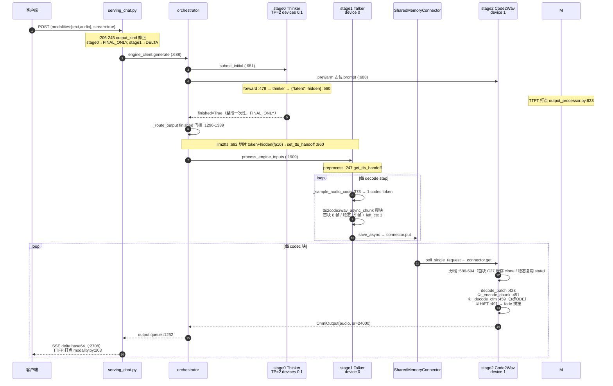

# MiniCPM-o 4.5 TTS 推理链路阅读指南（910C）

> 2026-08-20 · 面向"读懂当前 TTS 任务推理流程代码"的导读文档。
> 目标读者：接手优化/排查工作的工程师（Claude Code 或人）。
> 配套：时序图见本文 §2；台帳见 `submission/4_perf_report/metrics_summary.md`。

## 1. 全景：三个 stage 与当前配置

MiniCPM-o 4.5 是三阶段流式 omni 模型，TTS 请求（`modalities=[text,audio]`）跨三个独立引擎进程：

| Stage | 模型 | 进程/设备（champion C63） | 输入 | 输出 |
|---|---|---|---|---|
| 0 | Thinker LLM（8B Qwen2） | TP=2，devices "0,1" | 文本 prompt | 完整文本 + hidden（latent） |
| 1 | Talker（LlamaModel + head_code） | device 0 | handoff(ids + hidden) | codec token 流（逐 token） |
| 2 | Code2Wav（DiT flow + HiFT） | device 1 | codec 块（shm） | PCM 音频块（24kHz） |

关键 yaml 旋钮（`vllm_omni/deploy/minicpmo_4_5.yaml`，champion 值）：
- `codec_chunk_frames: 15`——稳态块 15 帧（0.6s 音频）
- `initial_codec_chunk_frames: 8`——首块 8 帧提前发（E6）
- `codec_left_context_frames: 3`——块间上下文
- `token2wav_n_timesteps: 3`——DiT ODE 步数（C57）
- `async_chunk: true` + `connector_of_shared_memory`（stage1→stage2 走 /dev/shm）

## 2. 时序图



延迟指标与阶段对应：

```
请求 ──► TTFT ───────► TTFP ──────────────────► RTF 分子（全程）
         │              │                          │
   stage0 prefill   handoff→talker 攒 8 帧    稳态循环（每块 0.6s 音频）
   +首个文本token    →ODE→HiFT→首包 PCM       15帧→ODE→HiFT→PCM delta
```

## 3. 核心文件阅读清单（按数据流顺序）

### 3.1 主干（必读）

**① `vllm_omni/model_executor/models/minicpmo_4_5/pipeline.py`** —— 先读，仅 80 行
三 stage 拓扑的"地图"：角色（llm/tts/code2wav）、final_output 类型、各桥接函数挂载点
（`custom_process_input_func=llm2tts`、`async_chunk_process_next_stage_input_func=tts2code2wav_async_chunk` 等）。

**② `vllm_omni/model_executor/models/minicpmo_4_5/minicpmo_4_5_omni.py`** —— stage0 + 两个桥函数
- `forward`（:478）：thinker 前向，`:560` 产出 `{"latent": text_hidden}`
- `llm2tts`（:692）：handoff 桥——找 tts_bos 边界（:779-814）、切片 token+hidden（fp16，C29b）、
  `set_tts_handoff`（:960）
- `tts2code2wav_async_chunk`（:217）：codec 攒块——首块 initial=8 / 稳态 15（:303-314）、
  静音前缀/left_context（:319-339）。E5/E6 优化的落点。

**③ `vllm_omni/model_executor/models/minicpmo_4_5/minicpmo_4_5_omni_tts.py`** —— stage1 Talker
- `preprocess`（:247）：消费 handoff，`get_tts_handoff`（:261）+ 条件向量（:213-245）
- `_sample_audio_code`（:373）/ `make_omni_output`（:408）：逐 step 采样 1 个 codec token
  （temp 0.8 / topk 25 / topp 0.85 / rep-penalty 1.05，min_tokens=50 EOS 屏蔽）

**④ `vllm_omni/model_executor/models/minicpmo_4_5/batched_token2wav.py`** —— stage2，RTF 主战场
- `decode_batch`（:423）：分桶批处理入口
- `_encode_chunk`（:162）：UpsampleConformerEncoder + proj
- `_decode_cfm`（:259）：CFM/DiT，ts=3 步 ODE（:295-317），CFG velocity（:310）
- `_estimator_step`（:199）+ `_ensure_adaLN_table`（:234）：C20 adaLN 预计算落点
- HiFT 调用（:491）+ `fade_in_out`（:405）：块间 overlap-add 拼接

### 3.2 管道（选读，看点名函数即可）

**⑤ `vllm_omni/engine/orchestrator.py`** —— 多 stage 调度中枢
- `_route_output`（:1296）：handoff 的 finished 门槛（stage0 FINAL_ONLY → 整段一次性交棒）
- `_forward_to_next_stage`（:1691）

**⑥ `vllm_omni/distributed/omni_connectors/transfer_adapter/chunk_transfer_adapter.py`** —— 流式传输
- `save_async`（:152）/ `_send_single_request`（:304）：攒块函数注入机制 + connector.put
- `_poll_single_request`（:200）：stage2 侧后台收块线程

**⑦ `vllm_omni/entrypoints/openai/serving_chat.py`** —— HTTP 层 + 指标（文件大，只看点名的）
- `_fix_minicpmo45_audio_stream_output_kinds`（:206）：MiniCPM-o 4.5 专属 output_kind 修正
- 音频 SSE 回传（:1973-2054）+ `_create_audio_choice`（:2618）
- TTFP 打点（:2002）/ audio_rtf finalize（omni_base.py:563）

### 3.3 NPU 专属补丁（短，顺带扫）

- `vllm_omni/platforms/npu/models/step_audio2_token2wav.py`：HiFT 480x 降采样替换（:32-48）+
  DiT mask/SDPA 强制 MATH（:85 起）——NPU 路径适配
- `vllm_omni/platforms/npu/models/cosyvoice2_dit_attn.py`：DiT attention NPU 路径
  （C20 patch 0002 的实际目标，monkey-patch 外部 cosyvoice2 包）

### 3.4 外部依赖（不在本仓库，在 910C 机 site-packages）

- DiT 本体：`cosyvoice2/flow/decoder_dit.py`（to_q/k/v、mlp、blocks_forward_chunk）
  ——`batched_token2wav.py` 里对 `flow.encoder`/`estimator.blocks` 的调用即调它
- stage2 权重加载：`StepAudio2Token2WavCore._ensure_models_loaded`
  （`vllm_omni/model_executor/models/step_audio2/step_audio2_token2wav.py:115-155`，
  `torch.load(flow.pt)` 直载，不走 vllm weight_loader 体系）

## 4. 关键机制速记

1. **stage0→stage1 handoff 是整段一次性交棒**（FINAL_ONLY + finished 门槛）：
   thinker 生成完整回复后才把 token ids + hidden 给 talker。C48 曾改 DELTA 流式（TTFT -71%）
   因 RTF 劣化回滚（patch 0006 留档未启用）。
2. **流式只有两层**：talker→stage2 的 codec 块（首块 8 帧/稳态 15 帧）+ stage2→客户端 PCM 块。
3. **stage0→stage1 不走 shm**（orchestrator 直接路由）；shm connector 只在 stage1→stage2。
4. **stage2 分桶批处理**：`_bucket_key`（minicpmo_4_5_code2wav.py:475）按 cache shape 严格分桶；
   首块走 C27 setup_batch 缓存 clone，稳态复用 per-request state。
5. **指标打点**：TTFT=文本首 token（output_processor.py:623）；TTFP=首个 audio 包
   （serving_chat.py:2002 → modality.py:203）；audio_rtf=finalize 时全程时延/音频时长
   （omni_base.py:563 → modality.py:143）。RTF 含 TTFT/TTFP——降首包也降 RTF（双吃）。
6. **C63 设备布局**：stage0 TP=2 双 die，stage2 独占 die1（与 stage0-r1 同卡）；
   设备锁序（`stage_runtime.py:573` acquire_device_locks）是 patch 0007 修的死锁点。

## 5. 建议阅读路线

1. `pipeline.py`（地图，10 分钟）
2. `minicpmo_4_5_omni.py` 的三个函数（forward / llm2tts / tts2code2wav_async_chunk）
3. `minicpmo_4_5_omni_tts.py` 的 preprocess + _sample_audio_code
4. `batched_token2wav.py` 全读（RTF 优化主战场，历史优化 E5/E6/C20/C27/C57 全落在这条链上）
5. 带着疑问再查 orchestrator / chunk_transfer_adapter / serving_chat 的点名函数
6. 对照 `vllm_omni/deploy/minicpmo_4_5.yaml` 确认旋钮落点

## 6. 历史优化与代码落点对照

| 优化 | 旋钮/代码 | 落点 |
|---|---|---|
| E5/E6 首块提前 | chunk 25→15 / initial 8 | yaml + `tts2code2wav_async_chunk` |
| C20 adaLN 预计算 | DiT adaLN 全表预计算 | `batched_token2wav.py:234` + patch 0002（外部 cosyvoice2） |
| C27 setup_batch 缓存 | 首块 ODE 结果 clone | `minicpmo_4_5_code2wav.py:180` `_setup_or_cached` |
| C29b handoff fp16 | hidden 不升 fp32 | `llm2tts` 切片（minicpmo_4_5_omni.py:826-828） |
| C57 ts3 | ODE 3 步 | yaml + `_decode_cfm` |
| C48 DELTA 流式（回滚） | stage0 DELTA | serving_chat.py:206-245 + patch 0006 |
| C63 TP=2 双 die | stage0 TP=2 + stage2 die1 | deploy yaml + patch 0007（锁序） |
